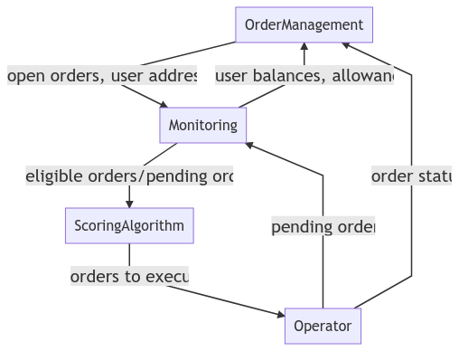
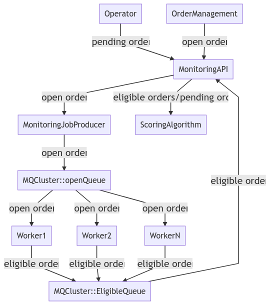
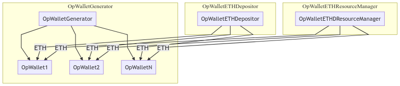
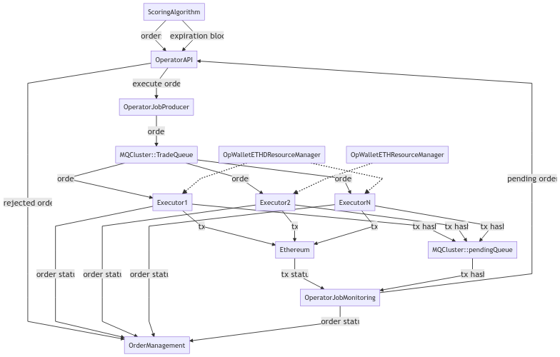

# Limit Order Backend Technical Specs

## Summary



Limit Order Backend consists of four main components:

1. OrderManagement: Rails application to create, update and provide list of open orders to Monitoring.
2. Monitoring: from list of open orders, returns all eligible orders and its user addresses to ScoringAlgorithm.
3. ScoringAlgorithm: decide which orders to execute to minimize risk and optimize revenue.
4. Operator: signing, broadcast trade transactions to Ethereum and monitoring their statuses.

Design goals:

- low latency
- scalable

For inter services communication, both gRPC and HTTP APIs will be used.

- OrderManagement <-> Monitoring: REST API/JSON, for saving development time as OrderManagement will be implements on 
    Ruby on Rails.
- The rest: gRPC/protobuf, for low latency and streaming capability.

Message queue will be used in Monitoring, Operator components to allow horizontal scaling.

- RabbitMQ
- Apache Kafka
- NATS   

## Smart Contracts

Limit Order Contract addresses:

- Ropsten: [0x880a6aD3Df09b6220639856e64B4Ab86f18f6095](https://ropsten.etherscan.io/address/0x880a6aD3Df09b6220639856e64B4Ab86f18f6095)

Monitoring Helper Contract addresses:

- Ropsten: [0xE5376f332D88d0127811813240AD8978Bb98A818](https://ropsten.etherscan.io/address/0xe5376f332d88d0127811813240ad8978bb98a818)

```solidity
interface ERC20 {
    function totalSupply() public view returns (uint supply);


    function balanceOf(address _owner) public view returns (uint balance);


    function transfer(address _to, uint _value) public returns (bool success);


    function transferFrom(address _from, address _to, uint _value) public returns (bool success);


    function approve(address _spender, uint _value) public returns (bool success);


    function allowance(address _owner, address _spender) public view returns (uint remaining);


    function decimals() public view returns (uint digits);


    event Approval(address indexed _owner, address indexed _spender, uint _value);
}


interface LimitOrder {
    // trades executes the order by calling KyberNetwork request.
    function executeLimitOrder(
        address user,
        uint256 nonce,
        ERC20 srcToken,
        uint srcQty,
        ERC20 destToken,
        address destAddress,
        uint minConversionRate,
        uint feeInPrecision,
        uint8 v,
        bytes32 r,
        bytes32 s
    );


    function isValidNonce(
        address user,
        uint256 concatenatedTokenAddresses,
        uint256 nonce
    );
}
```

### Limit Order

A limit order submitted from KyberSwap to OrderManagement will have following fields:

1. user address: Ethereum address of user
2. nonce: order of user/token pair. Calling `nonce` method of LimitOrder contract to get current nonce of token pair.
3. src token: source token ERC20 contract address
4. dest token: dest token ERC20 contract address
5. src amount: amount of src token
6. min rate: minimum src/dest conversion rate
7. dest address: Ethereum address of receiver
8. fee: percent of source token
9. signature: signature of above fields signed with user private key, will be passed as three separated fields, follow 
    output of Ethereum ECDSA signing scheme.  
  - r
  - s
  - v

#### Signing Scheme

Parameters are [tight packed](https://solidity.readthedocs.io/en/v0.4.18/abi-spec.html#non-standard-packed-mode) in 
following orders:

- user
- nonce
- src token
- src amount
- dest token
- dest address
- min rate
- fee

Examples, with private key `275bc23940a2061ecf0fa34341c0ca2b5d7b5e961032965610fbfda72b0572b7` and following order:

- user: 0xe122cd8d3d09271d1e999f766b19ada8d06b8ee9
- nonce: 0x7fd3e50013e911e7c479a10b8525728f00000000000000000000016afd268cd7
- source token: 0xbca556c912754bc8e7d4aad20ad69a1b1444f42d (WETH)
- source amount: 50000000000000000 (hex: 0x00000000000000000000000000000000000000000000000000b1a2bc2ec50000)
- dest token: 0x4e470dc7321e84ca96fcaedd0c8abcebbaeb68c6 (KNC)
- dest address: 0xe122cd8d3d09271d1e999f766b19ada8d06b8ee9
- min rate: 0 (hex: 0x0000000000000000000000000000000000000000000000000000000000000000)
- fee: 10000, 10% (hex : 0x0000000000000000000000000000000000000000000000000000000000002710)

The hash message is `0x749abf05e4127e63d42e5ee1e0d008e00dedb658590acdd301b8e47be9e0e655`

The signing string needs to be prefixed with `"\x19Ethereum Signed Message:\n"` + message.length + message like in [sign function](https://web3js.readthedocs.io/en/1.0/web3-eth-accounts.html#sign)

The signed data must be in RLP format to be able to submit.
Expected signature:
`0x6ee278f2037da07a9c879ba604edfb5824e7b75cc74fb4b0076c98d8dfcf219357f4d7d610c36d20cc7280c06de0b1c2997f9840dfc81c9af5f271af00107d3e1b`

Reference transaction: [tx hash](https://ropsten.etherscan.io/tx/0x35d7e8ed1ac25c8d1562d764d3f8aad131374cf84313620cf42d75db1346d284)

#### Eligible Order

An order is considered eligible to execute trade on smart contract when all of following conditions match.

1. signature matches
2. allowance is larger than src amount. This information could be obtained by calling token contract, using [allowance
    method](https://github.com/ethereum/EIPs/blob/master/EIPS/eip-20.md#allowance) with parameters:
    - tokenOwner: user address 
    - spender: limit order smart contract address
3. token balance is larger than src amount. This information could be obtained by calling token contract, 
    using [balanceOf](https://github.com/ethereum/EIPs/blob/master/EIPS/eip-20.md#balanceof) with parameters:
    - tokenOwner: user address
4. nonce is larger than current nonce. Current nonce could be obtained by calling method `nonce` of LimitOrder contract 
    with following params:
    - userAddress: user address
    - src: src token
    - dest: dest token
5. current rate on KybetNetwork is larger than min rate. Current rate is taken by calling method 
    [getExpectedRate](https://developer.kyber.network/docs/API_ABI-KyberNetworkInterface/#getexpectedrate) 
    of KyberNetworkProxy contract with following params:
    - src: src token
    - dest: dest token
    - srcQty: src amount
 
 ## OrderManagement
 
Support users managing their limit orders, provide open orders for the Monitor, 
allow Operator to update orders (status, actual receive amount, ...).  

### API

#### GET /api/orders
Returns a list of user's orders.

RETURNS:

```json
{
  "fields": [
    "id",
    "user_addr",
    "src",
    "dst",
    "src_amount",
    "min_rate",
    "dest_addr",
    "nonce",
    "fee",
    "status",
    "messages",
    "tx_hash",
    "created_at",
    "updated_at"
  ],
  "orders": [
    [
      12345,
      "0xDF481f6F16E6dDf5cFF73088f708bed60eF0FD32",
      "WETH",
      "KNC",
      10,
      0.003,
      "0xD850942eF8811f2A866692A623011bDE52a462C1",
      57818117002753298411002922520048253037538608343117297513952908572797262671854,
      0.1,
      "active",
      [],
      "tx_hash",
      1556784881,
      1556784882
    ]
  ]
}
```

#### POST /api/orders/
Creates a new order.

ARGUMENTS:
- user_address (required): user address
- nonce (required): 
- src_token (required): address of the source token
- dest_token (required): address of the dest token
- src_amount (required): amount of the source token
- min_rate (required): minimum rate to execute order
- dest_address (required): address of receiver
- fee (required): amount will be taken from src_amount in percentage as fee
- signature (required): 


RETURNS:

Returns the order object if success.
```json
{
    "success": true, 
    "order": {
      "id": 12345,
      "user_addr": "0xD850942eF8811f2A866692A623011bDE52a462C1",
      "src": "WETH",
      "dst": "KNC",
      "src_amount": 10,
      "min_rate": 0.003,
      "dest_addr": "0xD850942eF8811f2A866692A623011bDE52a462C1",
      "nonce": 57818117002753298411002922520048253037538608343117297513952908572797262671854,
      "fee": 0.1,
      "status": "open",
      "created_at": 1556784881,
      "updated_at": 1556784882
    }
}
```

#### PUT /api/orders/:id/cancel
Cancels a specificed order.

RETURNS:

Returns a cancelled parameter on success, otherwise, error will be returned.

```json
{
    "cancelled": true
}
```

#### GET /api/orders/nonce
Gets the latest nonce corespending with a token pair given user address. The nonce is construct from smart contract address (first 16 bytes) and timestamp to be an uint256 number.

RETURNS:

A nonce eligible for user to create new order with the given address and pairs.

```json
{
    "nonce": 57818117002753298411002922520048253037538608343117297513952908572797262671854
}
```

#### GET /api/orders/fee
Get the fee for a token pair.

ARGUMENTS:
- src (required): address of the source token
- dst (required): address of the dest token
- src_amount (required): amount of the source token
- dst_amount (required): amount of the dest token
- user_addr (required): user address

RETURNS:

Amount of fee, e.g: 0.005 (0.5%)

```json
{
    "success": true,
    "fee": 0.005
}
```

#### GET /internal/orders?open=true

Returns open orders, fields:

1. order id
2. user address
3. nonce
4. src token
5. dest token
6. src amount
7. min rate
8. dest address
9. fee
10. signature
11. status

Available statuses:

1. new
2. open
3. cancelled
4. pending
5. filled
6. invalid


Example:

```json
{
  "fields": [
    "id",
    "src",
    "dst",
    "src_amount",
    "min_rate",
    "addr",
    "nonce",
    "fee",
    "status",
    "signature",
    "created_at",
    "updated_at"
  ],
  "orders": [
    [
      12345,
      "0x41FD865439a320B9977329C209c13443386b56cA",
      "0x0D8775F648430679A709E98d2b0Cb6250d2887EF",
      10,
      0.003,
      "0xD850942eF8811f2A866692A623011bDE52a462C1",
      2,
      0.1,
      "open",
      "47173285a8d7341e5e972fc677286384f802f8ef42a5ec5f03bbfa254cb01fad",
      1556784881,
      1556784882
    ]
  ]
}
```

#### UPDATE /internal/orders/:id

Update specific order to mark it as about to be execute, or update result 
with tx_hash, tx_status, receival amount.

ARGUMENTS:

- status (required): 'in_progress', 'filled' or 'open'
- tx_hash
- tx_status: 'tx_pending', 'tx_mined', 'tx_success', 'tx_failed', 'tx_notfound'
- dst_amount
- message

RETURNS:

Return with updated parameter, in case
```json
{
    "updated": true
}
```

# in case user just cancel the order, it cant be executed
```json
{
    "updated": false,
    "reason": "cancelled"
}
```

### Notifier

Notify users every time order status changed. We plan to support notifying via email, Telegram or web, mobile app notification.

### House Keeping

Periodically validates all open orders. If order is no longer valid, updates its status to "invalid" and notify 
to user. 

## Monitoring



Get a list of open orders from OrderManagement, filters out illegible ones and push the rest to ScoringAlgorithm 
for further processing. Monitoring has 4 subcomponents:

- Message Queue Cluster
- Monitoring API
- Monitoring Job Producer
- Monitoring Worker

### Message Queue Cluster

Message Queue Clusters is a cluster of message queue server for scalable and high availability purpose. There are two 
main queues:

- open: stores open orders and the block number to check
- eligible: stores orders that workers determine as eligible to trade

### Monitoring API

Monitoring listens to [newHeads](https://github.com/ethereum/go-ethereum/wiki/RPC-PUB-SUB#newheads) event, records 
the current block (n) and calls Monitoring Job Producer. Monitoring API then sets a time ticker (t) that will collect 
all eligible orders and push to ScoringAlgorithm. All jobs completed after t will simply be discarded, operator will 
need to monitor the number of expired jobs and allocate hardware resources to eliminate it.

Monitoring will has two main services:

1.  streaming monitoring data to ScoringAlgorithm.

    - list of eligible orders
    - list of pending orders
    - users information, for each token
      - balance
      - allowance to LimitOrder contract
2. provide users information to be consumed by OrderManagement to verify submitted order

### Monitoring Job Producer

Monitoring Job Producer gets the list of open orders and block number from Monitoring API and spawns multiple jobs, 
place them in open queue of Message Queue Cluster. A job will contains multiple orders (n) to save execution time.
There are two kind of jobs:

- Order Eligible Check: check if given order is qualified to traded
- User Address Information: given a user address and list of ERC20 contract addresses, returns the user balances and 
    allowances to LimitOrder smart contract.
    
### Monitoring Workers

Monitoring listen for jobs in open queue of Message Queue Cluster, execute them and push the result to eligible 
queue. The system will be designed so adding more workers is simple and require no down time.

To check if an order is eligible to trade, worker will call a EligibleCheck smart contract that accepts a list or orders 
and returns a list of boolean values, to indicate which order is qualified.
    
## ScoringAlgorithm

ScoringAlgorithm receives a list of eligible orders, decides which orders to execute and push to Operator API.

ScoringAlgorithm will actively listen for MonitoringAPI (a grpc streaming service) for these data:
- List of executable orders, each contains: 
  - order id 
  - src_token
  - dst_token
  - amount
  - user_address
- List of pending orders, contain the similar data to executable order
- List of user's information, each contain:
  - user id
  - List of order data related to executable orders of that users include:
    - List of order id belong to user.
    - Map[userAddress][tokenAddress]: 
        - Allowance
        - Balance  
- BlockNumber of which these data came from

It will do computation and return the output:
- List of order ID with following data:
  - execute (boolean): whether to execute order or not
  - rejected_reason (string): reason why the eligible order is not selected to execute, in case execute is false.  
- Expiration block number: the return orders must be broadcast before this block number. Otherwise these orders are not 
to be executed. 

**Notices**:

- chain reorganization might happens, therefore there is no guarantee a bout block number order. Monitoring API might 
    push data for block n, than n - 1, than n + 10 chronologically.   

## Operator

Operator is the components to manage the operator wallets and execute the trades by calling trade method of LimitOrder
smart contract. There are two sub components:

- OpWalletManager
- OpWalletExecutor

### OpWalletManager



OpWalletManager in charges of generating operator wallets, deposit ETH to them and grant resources to executor worker.
OpWalletManager has three services:

#### OpWalletGenerator

From a preconfigured seed phrase, following [BIP32](https://github.com/bitcoin/bips/blob/master/bip-0032.mediawiki), 
generates a number of Ethereum operator wallets (n). Newly created wallets will be pushed to OpWalletETHDepositor to 
top up.

#### OpWalletETHDepositor

OpWalletETHDepositor periodically monitors list of operator wallets from OpWalletGenerator and send ETH to them to 
maintain minimum balance requirement.


#### OpWalletResourceManager

OpWalletResourceManager has an gRPC stream that grant a wallet private key to an executor worker. The executor workers 
is expected to send keep alive messages, if expired the resource will be revoked.

### OpWalletExecutor




OpWalletExecutor signs, broadcasts and monitors the trade transaction. OpWalletExecutor has following services:

- Message Queue Cluster
- Operator API
- Operator Job Producer
- Operator Worker
- Operator Job Monitoring

#### Message Queue Cluster

Message Queue Cluster has two queues:

- trades: orders that ScoringAlgorithm has decided to execute
- pending: orders that worker has broadcast and are waiting for status

#### Operator API

Operator API receive list of orders to execute, expiration block and returns pending orders status. 
It first pushed all orders with "execute" to Operator Job Producer than update the rejected reason to orders that 
were not selected to execute. 

#### Operator Job Producer

Operator Job Producer receives the list of orders, expiration block from Operator API and spawns one job for each order 
and places to trades queue.

#### Operator Worker

On startup, Operator Worker requests a private key from OpWalletResourceManager, the worker will periodically send a 
keep alive message to keep possession of the resource. Operator Workers listen for new job in trades queue, signs and 
broadcasts the order. Operator Workers must also assert that the current block number is less than expiration block, 
otherwise the trade order is simply discarded.

After that, the order, along with transaction hash is stored to pending queue of Message Queue
Cluster. Operator workers also update order status to "pending" and add the transaction hash. 

#### Operator Job Monitoring

Operator Job Monitoring monitors status of trade transactions in pending queue and determine its status after a number 
of blocks confirmation (n).
 
There are following possible outcomes:

- transaction is not mined: job is placed back to queue
- transaction is mined, but block confirmations < n: job is placed back to queue
- transaction is mined, block confirmations >= n:
  - transaction is reverted
    - update order status back to "open"
    - remove transaction hash
  - transaction is succeed
    - update order status to "filled"
    - update dest_amount 
